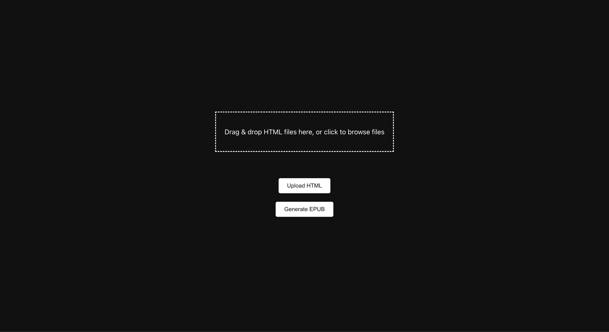
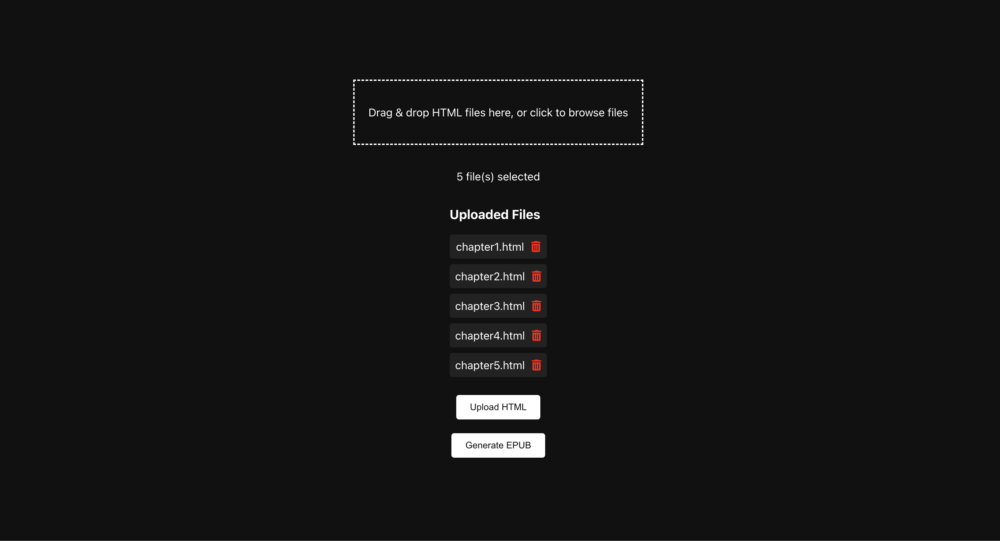
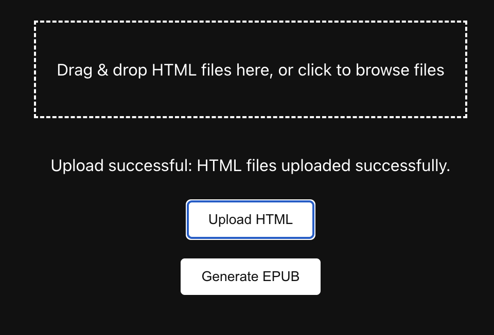
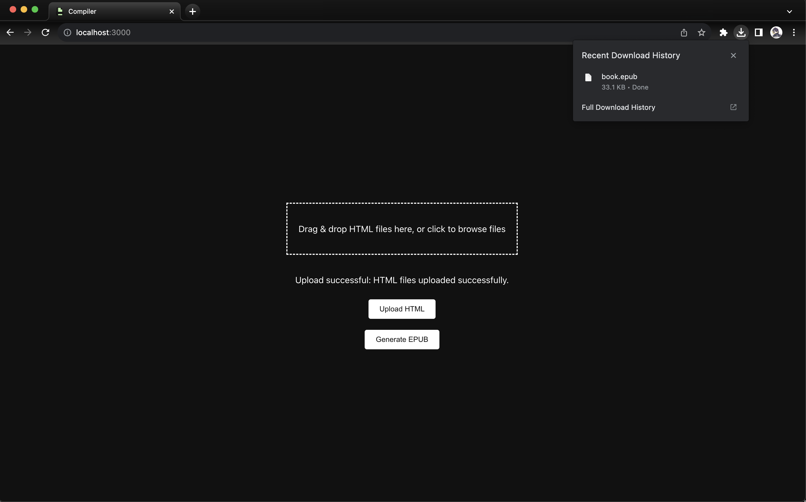

# Getting Started with Compiler

## Overview

This project acts as a means to convert and compile several HTML files into a single EPUB file.\
After running the project with the commands below you will see the following screen.

As you can see, this project allows for the upload of HTML files.\
This can be accomplished by either dropping files in or selecting the box to open the file explorer.\
If you forget a file, you can drop it in or upload it separately as this project allows multiple upload sessions.\

With your files uploaded, you can drag them around to reorder how they will appear in the resulting EPUB file, in order from top to bottom.\
If any files were uploaded in error, you may remove them via the delete button.\
Once your files are organization, you can then click the 'Upload HTML' button to send these files to the server, any issues will be shown in place of the file selection text.\

Upon successful upload, all files will be cleared and a confirmation message is shown.\
Now all that remains is to click the 'Generate EPUB' button to convert and compile the uploaded HTML files into an EPUB files.\

An automatic download will begin for your EPUB of compiled HTML files which can then be opened with an EPUB editor/reader.

This project was made as a sequel to a [prior project](https://replit.com/@savoiej/Website-to-Html) of mine in java which scraped and cleaned book chapters from online websites.\
Utilizing the cleaned and EPUB compliant HTML files from that project one can then convert and compile said chapters into an EPUB file to be read offline on any device.

## Available Scripts

In the project directory, you can run:

### `npm install`

Installs all the various dependencies to the node_modules folder.\
Ensure that you are doing so from the repositories directory, i.e 'cd compiler'

### `npm start`

Runs the app in the development mode.\
Open [http://localhost:3000](http://localhost:3000) to view it in your browser.

### `node index.js`

Runs the server for handling HTML file upload and EPUB generation, this is required for any requests.\
Ensure that this is run from a second terminal window, from the server directory, i.e 'cd server'

### `control + C`

Cancels either the local React frontend server, or the Node backend server, depending on directory.
